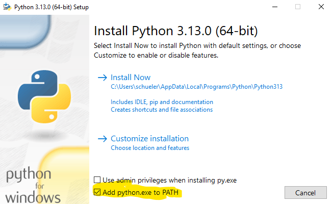

# Installation

Folge den Schritten um `antiafk.py` erfolgreich zu benutzen:

1. Gehe auf [python.org](python.org/ftp/python/3.13.0/python-3.13.0-amd64.exe) (Das ist der Downloadlink) und lade dir die neuste Python Version herunter
2. Öffne die **EXE** Datei und stelle fogendes ein:
 - Add Python to PATH -> Hacken



3. Öffne die Eingabeaufforderung *(CMD)* (Du musst "Add Python to PATH" aktiviert haben):
 - Führe den Befehl `pip` aus, es sollte eine lange Liste an Funtionen kommen
  - Führe jetzt, wenn kein Fehler kam, diesen Befehl aus:
  ```bash
  pip install pyautogui
  ```
Am wichtigsten ist das:


Jetzt kannst du `antiafk.py` mit einem Doppelklick öffnen
